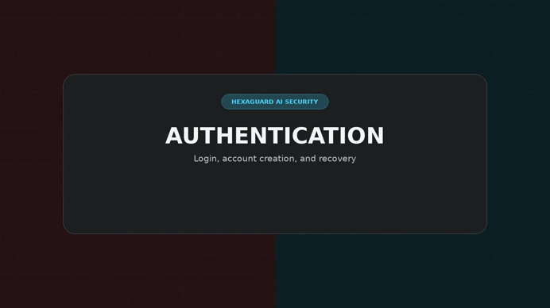
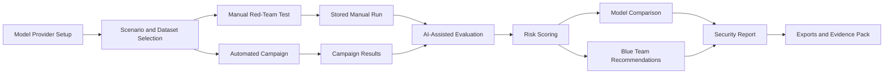
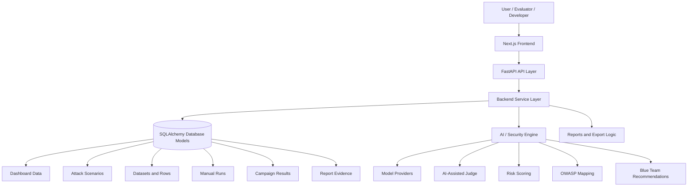
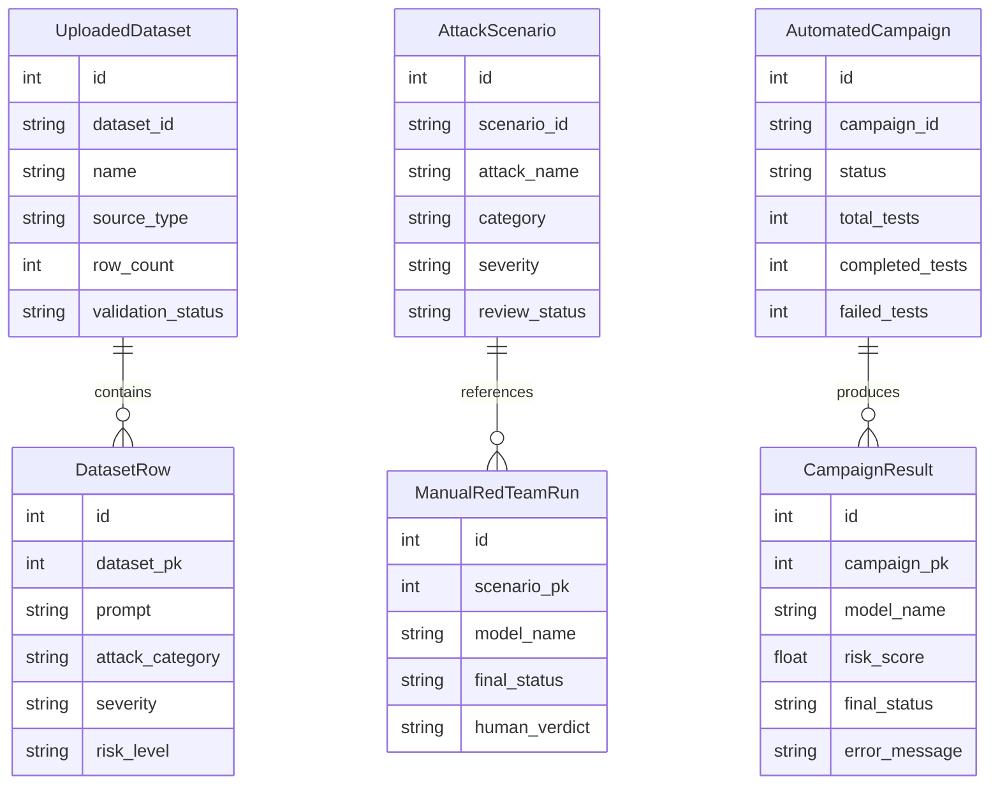
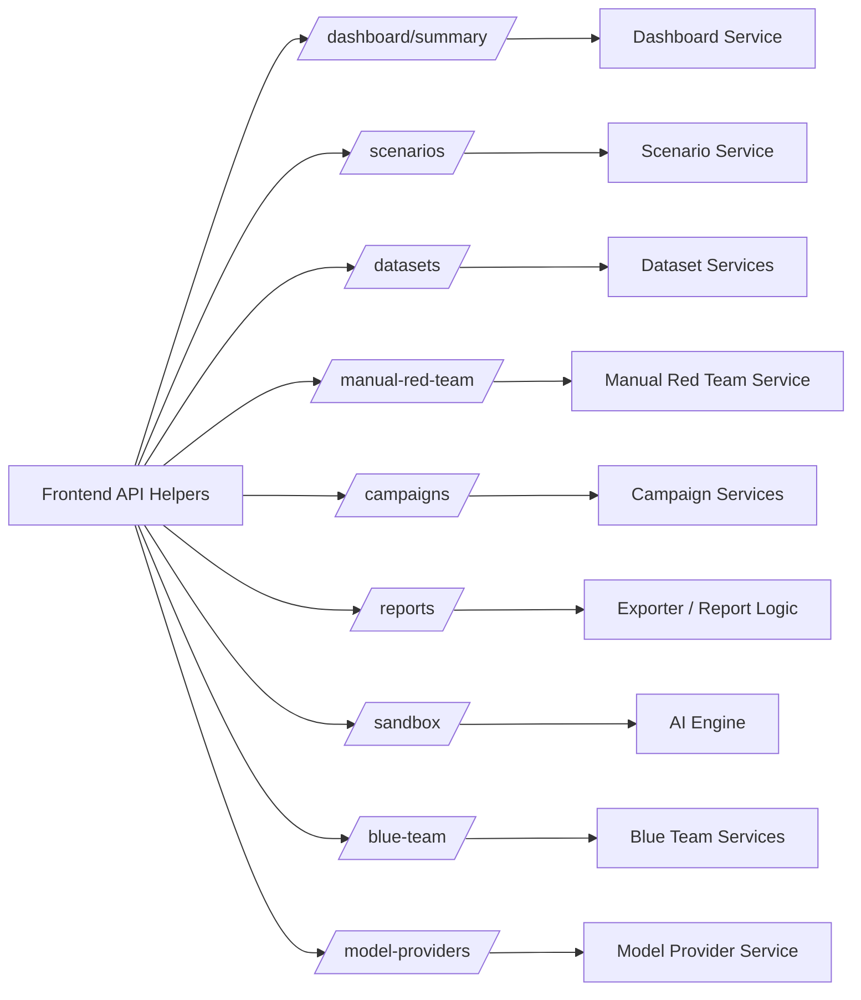

<div align="center">

<!-- Animated Header -->


----
<!-- Demo Preview -->


<br />
<h3>
  A full-stack AI security platform for testing, evaluating, comparing, and reporting large language model behavior.
</h3>
<p align="center">
  <b>HexaGuard</b> provides an end-to-end workflow for scenario-based LLM security testing, including model provider setup, attack scenario management, manual red-team testing, automated campaigns, AI-assisted response evaluation, risk scoring, model comparison, Blue Team recommendations, and structured security reporting.
</p>

<br />

<!-- Security Identity Badges -->


<br />

</div>


---

## Table of Contents

* [Project Overview](#project-overview)
* [Platform Workflow](#platform-workflow)
* [Core Capabilities](#core-capabilities)
* [Technology Stack](#technology-stack)
* [Project Architecture](#project-architecture)
* [AI and Security Engine](#ai-and-security-engine)
* [Database Design](#database-design)
* [Application Modules](#application-modules)
* [Functional Requirements](#functional-requirements)
* [Non-Functional Requirements](#non-functional-requirements)
* [API Overview](#api-overview)
* [Authentication and Access Control](#authentication-and-access-control)
* [Installation](#installation)
* [Running the Project](#running-the-project)
* [Environment Variables](#environment-variables)
* [Current Project Status](#current-project-status)

---

## Project Overview

**HexaGuard** is an AI security testing platform focused on red-teaming LLM-based systems.

The platform helps users prepare adversarial test inputs, run manual or automated tests, evaluate model responses, review risk scores, compare model behavior, generate defensive recommendations, and export final security reports.

HexaGuard is designed to make AI security testing more:

* **Structured** — using scenarios, datasets, campaigns, and reports.
* **Repeatable** — using reusable prompts, mutation strategies, and stored results.
* **Reviewable** — preserving evidence, model outputs, risk scores, and recommendations.
* **Actionable** — connecting red-team findings to Blue Team mitigation guidance.

### Why HexaGuard Matters

Modern AI systems can fail in ways that traditional web applications do not. Large language models may leak sensitive information, follow malicious prompts, hallucinate unsafe content, or behave inconsistently across providers.

| AI Security Problem         | HexaGuard Response                                               |
| --------------------------- | ---------------------------------------------------------------- |
| Prompt injection risks      | Scenario library, sandbox testing, and manual red-team workflows |
| Unsafe model responses      | Detection logic, AI-assisted judging, and risk scoring           |
| Inconsistent model behavior | Model provider testing and model comparison                      |
| Weak testing repeatability  | Automated campaigns and stored results                           |
| Poor evidence tracking      | Reports, evidence review, exports, and evidence packs            |
| Missing defensive guidance  | Blue Team recommendations and mitigation actions                 |

---

## Platform Workflow

<div align="center">

<table>
  <tr>
    <td align="center" width="16.6%">
      <h2>01</h2>
      <h3>🧩 Configure</h3>
      <sub>Register target models and provider settings</sub>
    </td>
    <td align="center" width="16.6%">
      <h2>02</h2>
      <h3>📚 Select</h3>
      <sub>Choose scenarios, datasets, and categories</sub>
    </td>
    <td align="center" width="16.6%">
      <h2>03</h2>
      <h3>🎯 Test</h3>
      <sub>Run manual tests or automated campaigns</sub>
    </td>
    <td align="center" width="16.6%">
      <h2>04</h2>
      <h3>🧠 Evaluate</h3>
      <sub>Analyze responses with detection and AI judging</sub>
    </td>
    <td align="center" width="16.6%">
      <h2>05</h2>
      <h3>📊 Score</h3>
      <sub>Calculate risk and compare model behavior</sub>
    </td>
    <td align="center" width="16.6%">
      <h2>06</h2>
      <h3>📄 Report</h3>
      <sub>Generate findings and mitigation guidance</sub>
    </td>
  </tr>
</table>

<br />


</div>

### Workflow Diagram



---

## Core Capabilities

<div align="center">

<table>
  <tr>
    <td width="50%" valign="top">
      <h3>🧩 Model Provider Setup</h3>
      <p>
        Configure target LLMs and provider settings so different models can be tested through a consistent red-teaming workflow.
      </p>
      <p>
        
        
      </p>
    </td>
    <td width="50%" valign="top">
      <h3>📚 Scenario and Asset Library</h3>
      <p>
        Manage reusable attack scenarios, prompts, categories, datasets, and evaluation inputs for repeatable manual and automated testing.
      </p>
      <p>
        
        
      </p>
    </td>
  </tr>

  <tr>
    <td width="50%" valign="top">
      <h3>🎯 Manual Red-Team Testing</h3>
      <p>
        Run targeted prompts against selected models to inspect specific risks, unsafe responses, policy violations, and model behavior under controlled conditions.
      </p>
      <p>
        
        
      </p>
    </td>
    <td width="50%" valign="top">
      <h3>⚙️ Automated Attack Campaigns</h3>
      <p>
        Execute batch red-team campaigns across scenarios, datasets, categories, target models, and mutation strategies to evaluate model resilience at scale.
      </p>
      <p>
        
        
      </p>
    </td>
  </tr>

  <tr>
    <td width="50%" valign="top">
      <h3>🧠 AI-Assisted Response Evaluation</h3>
      <p>
        Analyze model outputs using detection signals, response classification, AI-assisted judging, confidence indicators, and structured safety evaluation.
      </p>
      <p>
        
        
      </p>
    </td>
    <td width="50%" valign="top">
      <h3>📊 Risk Scoring and Model Comparison</h3>
      <p>
        Convert test outcomes into severity levels, risk scores, safety indicators, comparison insights, and report-ready evidence.
      </p>
      <p>
        
        
      </p>
    </td>
  </tr>

  <tr>
    <td width="50%" valign="top">
      <h3>🛡️ Blue Team Recommendations</h3>
      <p>
        Generate defensive guidance and mitigation actions to help reduce model risk and improve the security posture of AI systems.
      </p>
      <p>
        
        
      </p>
    </td>
    <td width="50%" valign="top">
      <h3>📄 Security Reporting</h3>
      <p>
        Produce structured reports that summarize test outcomes, risk levels, evidence, model performance, and recommended mitigation steps.
      </p>
      <p>
        
        
      </p>
    </td>
  </tr>
</table>

</div>

---

## Technology Stack

<div align="center">

<table>
  <tr>
    <td align="center" width="120">
      
      <br />
      <b>Next.js</b>
      <br />
      <sub>Frontend</sub>
    </td>
    <td align="center" width="120">
      
      <br />
      <b>React</b>
      <br />
      <sub>UI</sub>
    </td>
    <td align="center" width="120">
      
      <br />
      <b>TypeScript</b>
      <br />
      <sub>Language</sub>
    </td>
    <td align="center" width="120">
      
      <br />
      <b>FastAPI</b>
      <br />
      <sub>Backend</sub>
    </td>
  </tr>
  <tr>
    <td align="center" width="120">
      
      <br />
      <b>Python</b>
      <br />
      <sub>AI Logic</sub>
    </td>
    <td align="center" width="120">
      
      <br />
      <b>SQLAlchemy</b>
      <br />
      <sub>ORM</sub>
    </td>
    <td align="center" width="120">
      
      <br />
      <b>Alembic</b>
      <br />
      <sub>DB Migrations</sub>
    </td>
    <td align="center" width="120">
      
      <br />
      <b>Docker</b>
      <br />
      <sub>Container</sub>
    </td>
  </tr>
</table>

</div>

### Stack Summary

| Layer         | Technologies                                                                        | Purpose                                                                              |
| ------------- | ----------------------------------------------------------------------------------- | ------------------------------------------------------------------------------------ |
| Frontend      | Next.js, React, TypeScript, Tailwind CSS                                            | UI, routing, forms, dashboards, reports, loading states, and error states            |
| Backend       | FastAPI, Python, Pydantic                                                           | API layer, validation, business logic, campaign execution, and service orchestration |
| Database      | SQLAlchemy, Alembic                                                                 | Data models, ORM access, schema migrations, and persistence                          |
| AI / Security | Providers, evaluator, judge, mutation, risk scoring, OWASP mapping, Blue Team logic | LLM testing, response evaluation, scoring, comparison, and mitigation guidance       |
| Deployment    | Docker                                                                              | Container support and reproducible runtime setup                                     |

---

## Project Architecture

```text
HexaGuard/
├── frontend/
│   ├── src/app/
│   ├── src/components/
│   ├── src/lib/
│   └── src/types/
│
├── backend/
│   ├── app/api/v1/
│   ├── app/services/
│   ├── app/models/
│   ├── app/schemas/
│   ├── app/core/
│   └── app/db/
│
├── docs/
│   └── screenshots/
│
└── assets/
    └── hexaguard_demo_logical_clear_1080p.gif
```

### Architecture Diagram



### Application Flow

| Step | Description                                                                 |
| ---- | --------------------------------------------------------------------------- |
| 1    | User interacts with the Next.js frontend.                                   |
| 2    | Frontend API helpers call FastAPI endpoints.                                |
| 3    | Backend routes delegate work to service modules.                            |
| 4    | Services read and write data using SQLAlchemy models.                       |
| 5    | AI/security modules evaluate prompts, responses, risk, and recommendations. |
| 6    | Frontend displays dashboards, tables, tabs, modals, results, and reports.   |

---

## AI and Security Engine

The AI/security layer is responsible for evaluating prompts and model responses, detecting risky behavior, scoring results, comparing models, and generating Blue Team guidance.

```text
backend/app/services/
├── ai_engine/
│   ├── evaluator.py
│   ├── judge.py
│   ├── mutation.py
│   ├── model_connector.py
│   └── providers/
│
├── security_modules/
│   ├── input_risk_detector.py
│   ├── risk_scoring.py
│   ├── owasp_mapper.py
│   ├── campaign_input_risk.py
│   ├── input_evaluation_adapter.py
│   ├── rag_testing.py
│   └── blue_team.py
│
├── attack_runners/
│   ├── openai_runner.py
│   ├── anthropic_runner.py
│   ├── local_runner.py
│   └── router.py
│
└── blue_team_agents/
    └── orchestrator.py
```

### AI / Security Modules

| Module                        | Purpose                                                  |
| ----------------------------- | -------------------------------------------------------- |
| `providers/`                  | Connects to target LLM providers                         |
| `evaluator.py`                | Evaluates model behavior                                 |
| `judge.py`                    | Judges response safety or quality                        |
| `mutation.py`                 | Supports adversarial prompt mutation logic               |
| `model_connector.py`          | Connects model configuration with execution logic        |
| `input_risk_detector.py`      | Detects risky prompt/input patterns                      |
| `risk_scoring.py`             | Calculates security risk scores                          |
| `owasp_mapper.py`             | Maps findings to security categories                     |
| `campaign_input_risk.py`      | Evaluates campaign-level input risk                      |
| `input_evaluation_adapter.py` | Adapts input evaluation outputs for downstream workflows |
| `rag_testing.py`              | Supports RAG-related testing logic where available       |
| `blue_team.py`                | Provides defensive recommendation logic                  |
| `attack_runners/`             | Routes model execution through provider-specific runners |
| `blue_team_agents/`           | Supports Blue Team agent orchestration                   |

---

## Database Design

The confirmed database design is centered around six main SQLAlchemy-backed entities:

```text
AttackScenario
UploadedDataset
DatasetRow
ManualRedTeamRun
AutomatedCampaign
CampaignResult
```

These models support the main HexaGuard testing lifecycle:

```text
Scenario and dataset preparation
→ Manual or automated testing
→ Result storage
→ Dashboard, Reports, and Blue Team analysis
```

### Database Model Summary

| Model               | Main Responsibility                                         | Related Features                                  |
| ------------------- | ----------------------------------------------------------- | ------------------------------------------------- |
| `AttackScenario`    | Stores reusable attack scenario templates                   | Scenario Library, Manual Red Teaming, Campaigns   |
| `UploadedDataset`   | Stores uploaded or imported dataset metadata                | Datasets, Campaigns                               |
| `DatasetRow`        | Stores normalized prompt/test rows from datasets            | Datasets, Campaigns                               |
| `ManualRedTeamRun`  | Stores one analyst-controlled manual test result            | Manual Red Teaming, Dashboard, Reports, Blue Team |
| `AutomatedCampaign` | Stores automated campaign configuration and execution state | Campaigns, Dashboard, Reports                     |
| `CampaignResult`    | Stores each individual automated campaign test result       | Campaigns, Reports, Blue Team                     |

### Database Relationship Diagram



### Confirmed Database Relationships

| Source Entity      | Relationship  | Target Entity       | Notes                                                           |
| ------------------ | ------------- | ------------------- | --------------------------------------------------------------- |
| `DatasetRow`       | `dataset_pk`  | `UploadedDataset`   | Dataset rows belong to uploaded/imported datasets               |
| `ManualRedTeamRun` | `scenario_pk` | `AttackScenario`    | Nullable relationship                                           |
| `CampaignResult`   | `campaign_pk` | `AutomatedCampaign` | Campaign results belong to a campaign                           |
| `CampaignResult`   | `scenario_pk` | Scenario reference  | Stored as nullable integer; FK should be reviewed in model code |

### Seed Scenario Data

| Scenario ID | Scenario              |
| ----------- | --------------------- |
| `SCN-001`   | Prompt Injection      |
| `SCN-002`   | System Prompt Leakage |
| `SCN-003`   | RAG Context Injection |
| `SCN-004`   | Tool Misuse           |
| `SCN-005`   | Misinformation        |

---

## Application Modules

| Module             | Route              | Purpose                                |
| ------------------ | ------------------ | -------------------------------------- |
| Home / Dashboard   | `/`                | Main dashboard overview                |
| Dashboard          | `/dashboard`       | Dashboard alias route                  |
| Scenarios          | `/scenarios`       | Attack scenario management             |
| Datasets           | `/datasets`        | Dataset upload and testing workflow    |
| Manual Red Teaming | `/manual-red-team` | Single manual red-team testing         |
| Campaigns          | `/campaigns`       | Automated campaign testing             |
| Reports            | `/reports`         | Final analysis and export center       |
| Sandbox            | `/sandbox`         | Prompt/model testing workspace         |
| Model Settings     | `/settings/models` | Model provider testing/configuration   |
| Compare            | `/compare`         | Model comparison page                  |
| Blue Team          | `/blue-team`       | Recommendations and defensive analysis |

### Module Documentation Summary

| Module             | Frontend                                                                                       | Backend                                                            | Database Connection                                                                      |
| ------------------ | ---------------------------------------------------------------------------------------------- | ------------------------------------------------------------------ | ---------------------------------------------------------------------------------------- |
| Dashboard          | `page.tsx`, `dashboard/page.tsx`, `dashboardApi.ts`, `dashboard.ts`                            | `dashboard.py`, `dashboard_svc.py`                                 | `ManualRedTeamRun`, `AutomatedCampaign`, `CampaignResult`                                |
| Scenarios          | `scenarios/page.tsx`, `ScenarioForm.tsx`, `ScenarioTable.tsx`, `scenarioApi.ts`, `scenario.ts` | `scenarios.py`, `scenario_svc.py`                                  | `AttackScenario`                                                                         |
| Datasets           | `datasets/page.tsx`, `datasetApi.ts`, `hexaguardApi.ts`, `dataset.ts`                          | `datasets.py`, `dataset_svc.py`, connector/mapper services         | `UploadedDataset`, `DatasetRow`                                                          |
| Manual Red Teaming | `manual-red-team/page.tsx`, `manualRedTeamApi.ts`, `manualRedTeam.ts`                          | `manual_red_team.py`, `manual_red_team_svc.py`                     | `ManualRedTeamRun`, `AttackScenario`                                                     |
| Campaigns          | `campaigns/page.tsx`, `campaignApi.ts`, `campaignLibraryApi.ts`, `campaign.ts`                 | `campaigns.py`, `campaign_svc.py`, `campaign_runner_svc.py`        | `AutomatedCampaign`, `CampaignResult`, `AttackScenario`, `UploadedDataset`, `DatasetRow` |
| Reports            | `reports/page.tsx`, `ReportActions.tsx`                                                        | `reports.py`, `exporter.py`, campaign result routes                | `AutomatedCampaign`, `CampaignResult`, `ManualRedTeamRun`                                |
| Sandbox            | `sandbox/page.tsx`, `hexaguardApi.ts`, `api.ts`                                                | `sandbox.py`, AI engine evaluator/judge                            | Database connection not clearly shown                                                    |
| Model Providers    | `settings/models/page.tsx`, `modelProviderApi.ts`                                              | `model_providers.py`, `model_provider_svc.py`, `access_control.py` | No dedicated provider table clearly shown                                                |
| Blue Team          | `blue-team/page.tsx`, `blueTeamApi.ts`, `blueTeam.ts`                                          | `blue_team.py`, `blue_team_svc.py`, `blue_team_agent_svc.py`       | `ManualRedTeamRun`, possibly campaign findings depending on service usage                |
| Compare            | `compare/page.tsx`, `hexaguardApi.ts`                                                          | `sandbox.py`, model comparison endpoint                            | Database connection not clearly shown                                                    |

---

## Functional Requirements

| ID    | Requirement                       | Description                                                                            | Status                                              |
| ----- | --------------------------------- | -------------------------------------------------------------------------------------- | --------------------------------------------------- |
| FR-01 | Dashboard Overview                | Summarize platform activity, risk indicators, recent results, and security metrics     | Implemented                                         |
| FR-02 | Scenario Management               | Create, view, update, delete, search, and filter reusable attack scenarios             | Implemented                                         |
| FR-03 | Scenario Filtering                | Filter scenarios by category, severity, OWASP category, review status, or metadata     | Implemented                                         |
| FR-04 | Dataset Upload                    | Upload CSV or JSON datasets for testing or campaigns                                   | Implemented / partially connected depending on page |
| FR-05 | Dataset Import and Validation     | Import, validate, map, and normalize dataset rows                                      | Implemented in backend                              |
| FR-06 | Dataset Row Handling              | Store and process normalized dataset rows for campaign use                             | Implemented in backend                              |
| FR-07 | Manual Red-Team Testing           | Run a single human-driven red-team test against a selected model                       | Implemented                                         |
| FR-08 | Manual Run Storage                | Save manual prompt, model, response, evaluation, risk, verdict, and notes              | Implemented                                         |
| FR-09 | Sandbox Testing                   | Provide prompt testing, model testing, comparison, and dataset evaluation workflows    | Implemented                                         |
| FR-10 | Model Comparison                  | Compare model responses for the same prompt or scenario                                | Implemented                                         |
| FR-11 | Model Provider Listing            | List available model providers and model configuration options                         | Implemented                                         |
| FR-12 | Model Provider Testing            | Test model provider connectivity                                                       | Implemented                                         |
| FR-13 | Campaign Creation                 | Create campaigns using models, scenarios, categories, datasets, mutations, and limits  | Implemented                                         |
| FR-14 | Campaign Execution                | Run automated red-team campaigns through backend execution logic                       | Implemented                                         |
| FR-15 | Campaign Status Tracking          | Track campaign progress, counters, failures, and risk summaries                        | Implemented                                         |
| FR-16 | Campaign Results Storage          | Store prompt, mutation, response, evaluation, risk, score, status, and errors          | Implemented                                         |
| FR-17 | Reports Analysis                  | Review results, risks, model comparison, recommendations, and evidence                 | Implemented / expanded                              |
| FR-18 | Exact Campaign Report Loading     | Load reports through `/reports?campaignId=HXG-CMP-...`                                 | Implemented / should be verified                    |
| FR-19 | Risk Score Display                | Display risk scores, severity information, and summaries                               | Implemented                                         |
| FR-20 | Input and Output Risk Distinction | Distinguish risky input prompts from risky model outputs where data is available       | Implemented in reporting logic / should be verified |
| FR-21 | Evidence Review                   | Inspect detailed evidence for red-team results                                         | Implemented in Reports                              |
| FR-22 | Report Export                     | Support JSON, CSV, print/PDF, copy summary, and evidence pack export where implemented | Implemented in frontend                             |
| FR-23 | Blue Team Recommendations         | Generate or display defensive recommendations based on findings                        | Implemented                                         |
| FR-24 | Blue Team Agent Analysis          | Support agent-based defensive analysis for selected recommendations                    | Implemented                                         |
| FR-25 | OWASP Mapping                     | Map findings or scenarios to OWASP-style categories where available                    | Implemented                                         |
| FR-26 | Risk Scoring                      | Calculate or display risk scores for prompts, responses, campaigns, or results         | Implemented                                         |
| FR-27 | Seed Scenario Data                | Provide safe demo scenarios for initial testing and frontend demonstration             | Implemented                                         |
| FR-28 | Loading and Error States          | Show loading and error states when API calls are pending or fail                       | Implemented                                         |
| FR-29 | Navigation                        | Provide navigation between core modules                                                | Implemented                                         |
                                  

---

## Non-Functional Requirements

| ID     | Requirement           | Description                                                                                          | Status                                                     |
| ------ | --------------------- | ---------------------------------------------------------------------------------------------------- | ---------------------------------------------------------- |
| NFR-01 | Usability             | Interface should be clear, organized, and understandable for evaluators and developers               | Implemented / ongoing improvement                          |
| NFR-02 | Maintainability       | Separate pages, components, helpers, routes, services, schemas, and models                           | Implemented                                                |
| NFR-03 | Modularity            | Separate major functions into Scenarios, Datasets, Manual, Campaigns, Reports, Models, and Blue Team | Implemented                                                |
| NFR-04 | Type Safety           | Use TypeScript types for API data and page logic where possible                                      | Implemented / needs continued cleanup                      |
| NFR-05 | API Consistency       | Keep frontend helpers aligned with backend base URL and route structure                              | Partially implemented                                      |
| NFR-06 | Error Handling        | Display clear errors when API calls fail                                                             | Implemented                                                |
| NFR-07 | Loading Feedback      | Display loading states during API requests                                                           | Implemented                                                |
| NFR-08 | Data Integrity        | Validate and normalize scenario, dataset, manual run, and campaign data                              | Implemented in backend                                     |
| NFR-09 | Security Awareness    | Support red-team testing in a safe academic/demo context                                             | Implemented through validation and safe demo focus         |
| NFR-10 | Extensibility         | Allow new providers, risk modules, datasets, and report types                                        | Implemented through services/providers/modules             |
| NFR-11 | Scalability           | Support multiple models, scenarios, datasets, and result records                                     | Implemented at project level / may need production scaling |
| NFR-12 | Auditability          | Preserve enough evidence for review, reporting, and evaluation                                       | Implemented through manual/campaign records                |
| NFR-13 | Reliability           | Separate completed, failed, error, and review states                                                 | Implemented / should be continuously tested                |
                                   

### Quality Attribute Map

| Quality Attribute  | How HexaGuard Supports It                                                                                     |
| ------------------ | ------------------------------------------------------------------------------------------------------------- |
| Usability          | Clear page separation, workflow-based navigation, loading/error states, dashboard summaries, and report views |
| Maintainability    | Frontend pages, components, API helpers, backend routes, services, schemas, and models are separated          |
| Extensibility      | Provider modules, campaign services, security modules, and Blue Team agents can be extended                   |
| Reliability        | Campaign status, results, errors, and report states are handled separately                                    |
| Auditability       | Manual and campaign result models preserve prompts, responses, evaluations, risk scores, and notes            |
| Security Awareness | The platform focuses on evaluation, risk identification, OWASP mapping, and defensive recommendations         |

---

## API Overview

| Area               | API Prefix                | Purpose                                               |
| ------------------ | ------------------------- | ----------------------------------------------------- |
| Dashboard          | `/api/v1/dashboard`       | Dashboard summary and security metrics                |
| Sandbox            | `/api/v1/sandbox`         | Prompt testing, dataset testing, and model comparison |
| Scenarios          | `/api/v1/scenarios`       | Scenario CRUD and filtering                           |
| Datasets           | `/api/v1/datasets`        | Dataset upload, import, validation, and rows          |
| Manual Red Teaming | `/api/v1/manual-red-team` | Manual red-team run creation and management           |
| Campaigns          | `/api/v1/campaigns`       | Campaign creation, execution, status, and results     |
| Reports            | `/api/v1/reports`         | Report data and export-related logic                  |
| Blue Team          | `/api/v1/blue-team`       | Recommendations and Blue Team agent analysis          |
| Model Providers    | `/api/v1/model-providers` | Provider listing and connectivity testing             |

### API Architecture Map



---

## Authentication and Access Control

The current codebase includes access-control related logic in:

```text
backend/app/core/access_control.py
```


| Area                         | Description                                                       |
| ---------------------------- | ----------------------------------------------------------------- |
| Provider credential handling | Supports provider authentication or access checks                 |
| BYOK / custom key flow       | Supports user-provided model provider credentials where available |
| Demo credit logic            | Demo credit handling appears in access-control logic              |
| Provider testing             | Works with model provider testing workflows                       |

---

## Installation

### Clone the Repository

```bash
git clone https://github.com/WASAN-ALMUTAAN1/Hexaguard.git
cd Hexaguard
```

### Frontend Dependencies

```bash
cd frontend
npm install
```

### Backend Dependencies

```bash
cd backend
pip install -r requirements.txt
```

---

## Running the Project

### Start the Backend

```bash
cd backend
python -m uvicorn app.main:app --reload
```

Backend URL:

```text
http://127.0.0.1:8000
```

FastAPI Docs:

```text
http://127.0.0.1:8000/docs
```

### Start the Frontend

```bash
cd frontend
npm run dev
```

Frontend URL:

```text
http://localhost:3000
```

### Build the Frontend

```bash
cd frontend
npm run build
```

---

## Environment Variables

### Frontend

A frontend `.env.example` shows:

```env
NEXT_PUBLIC_API_BASE_URL=http://127.0.0.1:8000/api/v1
```

Some frontend code may also read:

```env
NEXT_PUBLIC_HEXAGUARD_API_URL=http://127.0.0.1:8000/api/v1
```

> Confirm the active `.env.example` before treating both variables as officially required.

### Backend

Backend configuration reads environment variables through:

```text
backend/app/core/config.py
```

> The exact backend `.env.example` content should be confirmed before documenting official required backend variables.

---

## Current Project Status

| Area               | Current Status                                                                                           |
| ------------------ | -------------------------------------------------------------------------------------------------------- |
| Frontend           | Implemented with Next.js App Router                                                                      |
| Backend            | Implemented with FastAPI                                                                                 |
| Dashboard          | Implemented and connected to backend summary data                                                        |
| Scenarios          | CRUD workflow implemented                                                                                |
| Datasets           | Dataset testing upload workflow implemented; deeper persistent dataset UI connection should be confirmed |
| Manual Red Teaming | Manual run helper and backend routes exist                                                               |
| Campaigns          | Campaign create/run/status/results workflow exists                                                       |
| Reports            | Final analysis page implemented and expanded                                                             |
| Sandbox            | Sandbox test and compare helpers exist                                                                   |
| Model Providers    | Provider list/test workflow exists                                                                       |
| Blue Team          | Recommendations and agent analysis workflow exists                                                       |
| Compare            | Present; report-ready comparison is being moved into Reports                                             |
| Authentication     | Full persistent auth/user model is not clearly shown in current active model files                       |
| Build Warnings     | Some unused variables/components are present and should be cleaned later                                 |


---

## Strengths

| Area                | Strength                                                                                                |
| ------------------- | ------------------------------------------------------------------------------------------------------- |
| Architecture        | Clear separation between frontend, backend, AI/security logic, schemas, services, and database models   |
| Full-stack scope    | Includes frontend pages, backend APIs, database models, and AI-specific services                        |
| Domain relevance    | Focuses on AI security, LLM testing, red-team workflows, and defensive recommendations                  |
| Evaluation workflow | Supports manual tests, automated campaigns, risk scoring, model comparison, and reporting               |


---

## Notes for Future Improvement

| Area                  | Recommendation                                                                        |
| --------------------- | ------------------------------------------------------------------------------------- |
| Authentication        | Confirm or implement persistent user accounts and role-based access control if needed |
| Environment Variables | Align frontend and backend `.env.example` files with actual code usage                |
| Reports               | Verify exact campaign loading and manual report integration                           |
| Compare Page          | Decide whether comparison remains standalone or fully moves into Reports              |
| Dataset UI            | Confirm persistent dataset management is fully connected to backend storage           |
| Code Cleanup          | Remove unused variables/components and standardize API helper usage                   |


