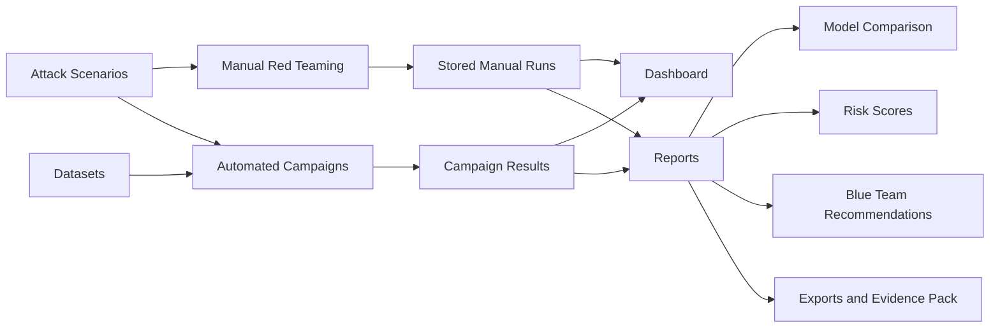
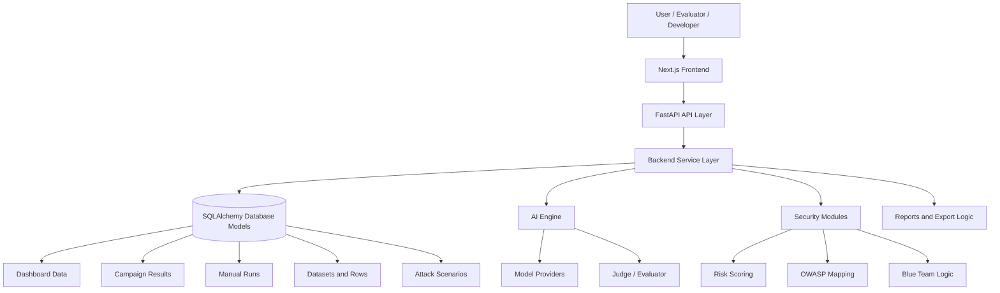
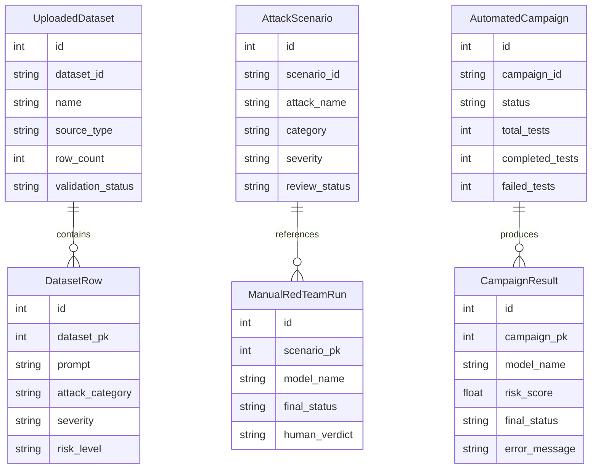
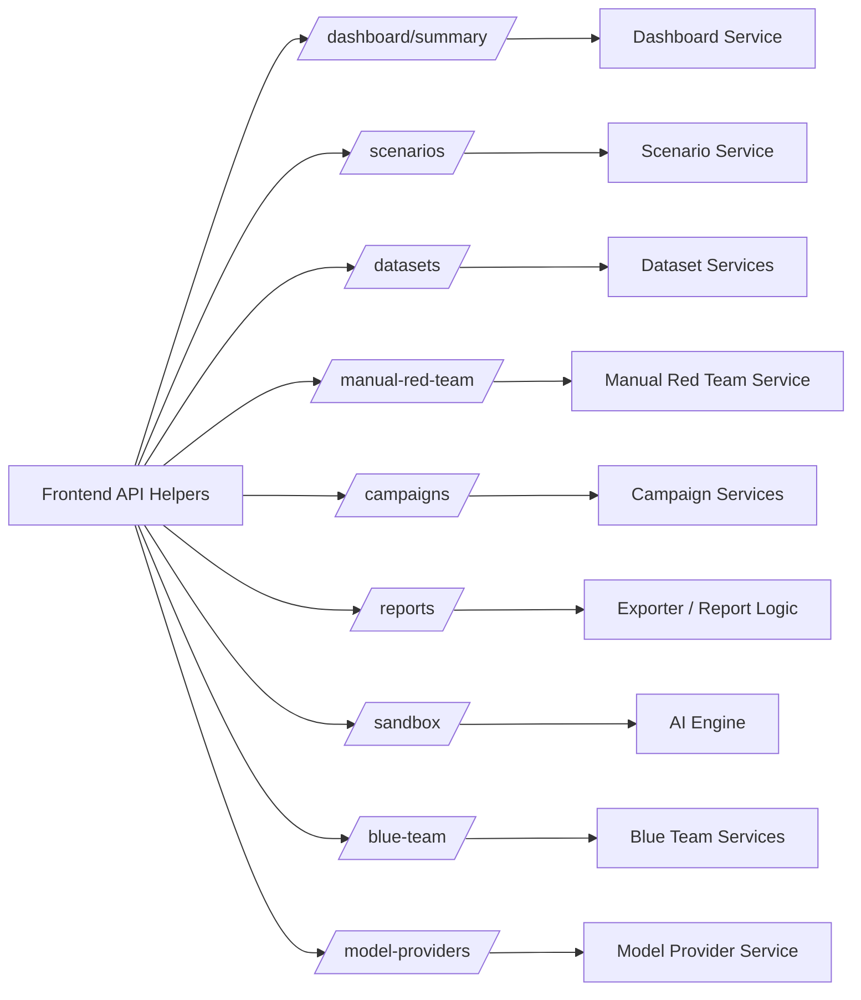

<div align="center">

# 🛡️ HexaGuard

### AI Red-Teaming Platform for LLM Security Testing

**HexaGuard** is a full-stack AI red-teaming platform designed to help users test, evaluate, compare, and report the security behavior of large language models and AI systems.

It combines a modern Next.js frontend, FastAPI backend, SQLAlchemy database models, automated campaign testing, manual red-team testing, sandbox evaluation, model provider testing, AI evaluation, risk scoring, Blue Team recommendations, and final security reporting.

<br />


<br />


</div>

---

## Table of Contents

* [Project Overview](#project-overview)
* [Why HexaGuard Matters](#why-hexaguard-matters)
* [Core Workflow](#core-workflow)
* [Technology Stack](#technology-stack)
* [Project Architecture](#project-architecture)
* [Functional Requirements](#functional-requirements)
* [Non-Functional Requirements](#non-functional-requirements)
* [Frontend Section](#frontend-section)
* [Backend Section](#backend-section)
* [AI and Security Section](#ai-and-security-section)
* [Database Design](#database-design)
* [Authentication and Access Control](#authentication-and-access-control)
* [Pages and Routes](#pages-and-routes)
* [Detailed Page Documentation](#detailed-page-documentation)
* [API Overview](#api-overview)
* [Installation](#installation)
* [Running the Project](#running-the-project)
* [Environment Variables](#environment-variables)
* [Screenshots](#screenshots)
* [Documentation Website](#documentation-website)
* [Current Project Status](#current-project-status)
* [Future Improvements](#future-improvements)

---

## Project Overview

**HexaGuard** is an AI security testing platform focused on red-teaming LLM-based systems.

The platform helps users prepare adversarial test inputs, run manual or automated tests, evaluate model responses, review risk scores, compare model behavior, generate defensive recommendations, and export final security reports.

The project is divided into three main parts:

<table>
  <tr>
    <td width="33%" valign="top">
      <h3>Frontend</h3>
      <p>
        User interface, application routes, forms, dashboards, result views,
        reports, filters, tabs, tables, loading states, error states, and export actions.
      </p>
    </td>
    <td width="33%" valign="top">
      <h3>Backend</h3>
      <p>
        FastAPI routes, business services, schemas, database access,
        campaign execution, dataset handling, manual runs, dashboard data,
        reports, and API responses.
      </p>
    </td>
    <td width="33%" valign="top">
      <h3>AI / Security</h3>
      <p>
        Model providers, evaluators, judge logic, prompt mutation, input risk detection,
        risk scoring, OWASP mapping, attack runners, and Blue Team logic.
      </p>
    </td>
  </tr>
</table>

---

## Why HexaGuard Matters

Modern AI systems can fail in ways that traditional web applications do not. Large language models may leak sensitive information, follow malicious prompts, hallucinate unsafe content, or behave inconsistently across providers.

HexaGuard is designed to make AI security testing more structured, repeatable, and reviewable.

| Problem                     | HexaGuard Response                           |
| --------------------------- | -------------------------------------------- |
| Prompt injection risks      | Attack scenarios and sandbox testing         |
| Unsafe model responses      | Evaluation, judge logic, and risk scoring    |
| Inconsistent model behavior | Model comparison and provider testing        |
| Weak testing repeatability  | Automated campaigns and stored results       |
| Poor evidence tracking      | Reports, evidence review, and export actions |
| Missing defensive guidance  | Blue Team recommendations and agent analysis |

---

## Core Workflow

```text
Scenarios  → Prepare reusable attack prompts
Datasets   → Prepare prompt datasets
Manual     → Run one human-driven red-team test
Campaigns  → Run automated or batch tests
Reports    → Analyze results, risks, model comparison, recommendations, exports
Models     → Configure and test model providers
```

| Module                 | Role                                                                                          |
| ---------------------- | --------------------------------------------------------------------------------------------- |
| **Scenarios**          | Create and manage reusable attack scenarios                                                   |
| **Datasets**           | Upload and test prompt datasets                                                               |
| **Manual Red Teaming** | Run one focused human-driven test                                                             |
| **Campaigns**          | Run automated or batch red-team campaigns                                                     |
| **Reports**            | Review final results, risk scores, model comparison, recommendations, and exportable evidence |
| **Model Settings**     | Test and manage available model providers                                                     |
| **Sandbox**            | Experiment with prompt/model testing workflows                                                |
| **Blue Team**          | Review defensive recommendations and agent analysis                                           |
| **Compare**            | Model comparison page; report-ready comparison is being moved into Reports                    |

### Workflow Diagram



---

## Technology Stack

### Frontend

| Technology       | Usage                         |
| ---------------- | ----------------------------- |
| **Next.js**      | App Router frontend framework |
| **React**        | UI component development      |
| **TypeScript**   | Type-safe frontend logic      |
| **Tailwind CSS** | Styling and responsive UI     |
| **npm**          | Frontend package management   |

### Backend

| Technology     | Usage                                    |
| -------------- | ---------------------------------------- |
| **FastAPI**    | Backend API framework                    |
| **Python**     | Backend services and AI/security modules |
| **SQLAlchemy** | Database models and ORM                  |
| **Alembic**    | Database migrations                      |
| **Pydantic**   | Request and response schemas             |
| **Docker**     | Container support                        |

### AI / Security

| Area                  | Purpose                                                 |
| --------------------- | ------------------------------------------------------- |
| **Model Providers**   | Connect and test target LLM providers                   |
| **Evaluator / Judge** | Evaluate model response behavior                        |
| **Risk Scoring**      | Score input/output risk                                 |
| **OWASP Mapping**     | Map findings to security categories                     |
| **Prompt Mutation**   | Support adversarial prompt variations                   |
| **Blue Team Logic**   | Generate defensive recommendations                      |
| **Attack Runners**    | Route model execution through provider-specific runners |

---

## Project Architecture

```text
HexaGuard-Clean-Team/
├── frontend/
│   ├── src/app/
│   ├── src/components/
│   ├── src/lib/
│   └── src/types/
│
├── backend/
│   ├── app/api/v1/
│   ├── app/services/
│   ├── app/models/
│   ├── app/schemas/
│   ├── app/core/
│   └── app/db/
│
└── docs/
    └── screenshots/
```

### Architecture Diagram



### Application Flow

| Step | Description                                                                      |
| ---- | -------------------------------------------------------------------------------- |
| 1    | User interacts with the Next.js frontend.                                        |
| 2    | Frontend API helpers call FastAPI endpoints.                                     |
| 3    | Backend routes delegate work to service modules.                                 |
| 4    | Services read/write data using SQLAlchemy models.                                |
| 5    | AI/security modules evaluate prompts, outputs, risk, and recommendations.        |
| 6    | Frontend displays results through dashboards, tables, tabs, modals, and reports. |

---

# Functional Requirements

This section summarizes the main functional requirements supported by the current HexaGuard project structure. These requirements are written for instructors, judging panels, evaluators, and future developers.

## Functional Requirements Overview

| ID    | Requirement                       | Description                                                                                                                                             | Current Status                                      |
| ----- | --------------------------------- | ------------------------------------------------------------------------------------------------------------------------------------------------------- | --------------------------------------------------- |
| FR-01 | Dashboard Overview                | The system shall provide a dashboard that summarizes platform activity, risk indicators, recent results, and security-related metrics.                  | Implemented                                         |
| FR-02 | Scenario Management               | The system shall allow users to create, view, update, delete, search, and filter reusable attack scenarios.                                             | Implemented                                         |
| FR-03 | Scenario Filtering                | The system shall support filtering scenarios by category, severity, OWASP category, review status, or related metadata where available.                 | Implemented                                         |
| FR-04 | Dataset Upload                    | The system shall allow users to upload CSV or JSON datasets for testing or campaign workflows.                                                          | Implemented / partially connected depending on page |
| FR-05 | Dataset Import and Validation     | The backend shall support dataset import, validation, mapping, and row normalization.                                                                   | Implemented in backend                              |
| FR-06 | Dataset Row Handling              | The system shall store and process normalized dataset rows for campaign use.                                                                            | Implemented in backend                              |
| FR-07 | Manual Red-Team Testing           | The system shall allow users to run a single human-driven red-team test against a selected model.                                                       | Implemented                                         |
| FR-08 | Manual Run Storage                | The system shall save manual red-team evidence, including prompt, model, response, evaluation, risk assessment, verdict, and notes.                     | Implemented                                         |
| FR-09 | Sandbox Testing                   | The system shall provide a sandbox for prompt testing, model testing, comparison, and dataset-based evaluation workflows.                               | Implemented                                         |
| FR-10 | Model Comparison                  | The system shall allow users to compare model responses for the same prompt or scenario.                                                                | Implemented                                         |
| FR-11 | Model Provider Listing            | The system shall list available model providers and model configuration options.                                                                        | Implemented                                         |
| FR-12 | Model Provider Testing            | The system shall allow users to test model provider connectivity.                                                                                       | Implemented                                         |
| FR-13 | Campaign Creation                 | The system shall allow users to create automated red-team campaigns using selected models, scenarios, categories, datasets, mutations, and test limits. | Implemented                                         |
| FR-14 | Campaign Execution                | The system shall run automated red-team campaigns using backend campaign execution logic.                                                               | Implemented                                         |
| FR-15 | Campaign Status Tracking          | The system shall provide campaign progress, status, counters, failures, and risk summary information.                                                   | Implemented                                         |
| FR-16 | Campaign Results Storage          | The system shall store campaign test results including prompt, mutation, response, evaluation, risk assessment, score, status, and errors.              | Implemented                                         |
| FR-17 | Reports Analysis                  | The system shall provide a Reports page for reviewing results, risks, model comparison, recommendations, and exportable evidence.                       | Implemented / recently expanded                     |
| FR-18 | Exact Campaign Report Loading     | Reports shall support loading a specific campaign using `/reports?campaignId=HXG-CMP-...`.                                                              | Implemented / should be verified                    |
| FR-19 | Risk Score Display                | The system shall display risk scores, severity information, and risk summaries.                                                                         | Implemented                                         |
| FR-20 | Input and Output Risk Distinction | The system should distinguish between risky input prompts and risky model outputs where data is available.                                              | Implemented in reporting logic / should be verified |
| FR-21 | Evidence Review                   | The system shall provide a way to inspect detailed evidence for red-team results.                                                                       | Implemented in Reports                              |
| FR-22 | Report Export                     | The system shall support JSON, CSV, print/PDF, copy summary, and evidence pack export where implemented.                                                | Implemented in frontend                             |
| FR-23 | Blue Team Recommendations         | The system shall generate or display defensive recommendations based on security findings.                                                              | Implemented                                         |
| FR-24 | Blue Team Agent Analysis          | The system shall support agent-based defensive analysis for selected recommendations.                                                                   | Implemented                                         |
| FR-25 | OWASP Mapping                     | The system shall map findings or scenarios to OWASP-style categories where available.                                                                   | Implemented                                         |
| FR-26 | Risk Scoring                      | The system shall calculate or display risk scores for prompts, responses, campaigns, or results where available.                                        | Implemented                                         |
| FR-27 | Seed Scenario Data                | The system shall provide safe demo scenarios for initial testing and frontend demonstration.                                                            | Implemented                                         |
| FR-28 | Loading and Error States          | The frontend shall show loading and error states when API calls are pending or fail.                                                                    | Implemented                                         |
| FR-29 | Navigation                        | The frontend shall provide navigation between core modules.                                                                                             | Implemented                                         |
| FR-30 | Documentation and Screenshots     | The project shall include README documentation and screenshot placeholders for GitHub presentation.                                                     | In progress                                         |

## Functional Requirements by Module

| Module                 | Key Functional Requirements                                                             |
| ---------------------- | --------------------------------------------------------------------------------------- |
| **Scenario Library**   | Create, list, update, delete, search, and filter attack scenarios.                      |
| **Datasets**           | Upload datasets, validate data, normalize rows, and prepare prompt batches.             |
| **Manual Red Teaming** | Run a single human-driven model test and store test evidence.                           |
| **Campaigns**          | Configure, create, run, monitor, and review automated red-team campaigns.               |
| **Reports**            | Analyze final results, risks, evidence, model comparison, recommendations, and exports. |
| **Blue Team**          | Display recommendations, filter findings, and run defensive agent analysis.             |
| **Model Settings**     | List and test provider connectivity.                                                    |
| **Sandbox**            | Experiment with prompt tests, model comparison, and dataset evaluation.                 |

---

# Non-Functional Requirements

Non-functional requirements describe the quality attributes expected from HexaGuard. These are important for software engineering evaluation because they explain how the system should behave beyond its visible features.

## Non-Functional Requirements Overview

| ID     | Requirement           | Description                                                                                                                   | Current Status                                             |
| ------ | --------------------- | ----------------------------------------------------------------------------------------------------------------------------- | ---------------------------------------------------------- |
| NFR-01 | Usability             | The interface should be clear, organized, and easy for developers, instructors, evaluators, and security users to understand. | Implemented / ongoing improvement                          |
| NFR-02 | Maintainability       | The project should separate pages, components, helpers, routes, services, schemas, and models.                                | Implemented                                                |
| NFR-03 | Modularity            | Major functions should be separated into Scenarios, Datasets, Manual, Campaigns, Reports, Models, and Blue Team.              | Implemented                                                |
| NFR-04 | Type Safety           | The frontend should use TypeScript types for API data and page logic where possible.                                          | Implemented / needs continued cleanup                      |
| NFR-05 | API Consistency       | Frontend API helpers should consistently use the same backend base URL and route structure.                                   | Partially implemented                                      |
| NFR-06 | Error Handling        | The frontend should display clear error messages when API calls fail.                                                         | Implemented                                                |
| NFR-07 | Loading Feedback      | The frontend should display loading states during API requests.                                                               | Implemented                                                |
| NFR-08 | Data Integrity        | Backend services should validate and normalize scenario, dataset, manual run, and campaign data.                              | Implemented in backend                                     |
| NFR-09 | Security Awareness    | The platform should support red-team testing in a safe academic/demo context.                                                 | Implemented through validation/safe demo focus             |
| NFR-10 | Extensibility         | The architecture should allow adding new providers, risk modules, datasets, and report types.                                 | Implemented through services/providers/modules             |
| NFR-11 | Scalability           | Campaigns should support multiple models, scenarios, datasets, and result records.                                            | Implemented at project level / may need production scaling |
| NFR-12 | Auditability          | Results should preserve enough evidence for review, reporting, and instructor evaluation.                                     | Implemented through manual/campaign result records         |
| NFR-13 | Reliability           | Campaign status and result views should separate completed, failed, error, and review states.                                 | Implemented / should be continuously tested                |
| NFR-14 | Documentation Quality | The project should provide clear README, page documentation, screenshots, and setup instructions.                             | In progress                                                |
| NFR-15 | Presentation Quality  | The GitHub README should be visually clear, professional, and suitable for judging panels.                                    | In progress                                                |

## Quality Attribute Map

| Quality Attribute      | How HexaGuard Supports It                                                                                      |
| ---------------------- | -------------------------------------------------------------------------------------------------------------- |
| **Usability**          | Clear page separation, workflow-based navigation, loading/error states, dashboard summaries, and report views. |
| **Maintainability**    | Frontend pages, components, API helpers, backend routes, services, schemas, and models are separated.          |
| **Extensibility**      | Provider modules, campaign services, security modules, and Blue Team agents can be extended.                   |
| **Reliability**        | Campaign status, results, errors, and report states are handled separately.                                    |
| **Auditability**       | Manual and campaign result models preserve prompts, responses, evaluations, risk scores, and notes.            |
| **Security Awareness** | The platform focuses on evaluation, risk identification, OWASP mapping, and defensive recommendations.         |

---

# Frontend Section

## Frontend Structure

```text
frontend/
├── package.json
├── next.config.mjs
├── postcss.config.mjs
├── tailwind.config.ts
├── tsconfig.json
└── src/
    ├── app/
    │   ├── page.tsx
    │   ├── dashboard/
    │   ├── scenarios/
    │   ├── datasets/
    │   ├── manual-red-team/
    │   ├── campaigns/
    │   ├── reports/
    │   ├── sandbox/
    │   ├── settings/
    │   │   └── models/
    │   ├── compare/
    │   ├── blue-team/
    │   ├── layout.tsx
    │   └── globals.css
    │
    ├── components/
    │   ├── AppShell.tsx
    │   ├── Sidebar.tsx
    │   ├── LoadingState.tsx
    │   ├── ErrorState.tsx
    │   ├── SeverityBadge.tsx
    │   ├── OwaspBadge.tsx
    │   ├── ReportActions.tsx
    │   ├── ScenarioForm.tsx
    │   ├── ScenarioTable.tsx
    │   ├── campaign/
    │   └── blue-team/
    │
    ├── lib/
    │   ├── api.ts
    │   ├── hexaguardApi.ts
    │   ├── dashboardApi.ts
    │   ├── scenarioApi.ts
    │   ├── datasetApi.ts
    │   ├── manualRedTeamApi.ts
    │   ├── campaignApi.ts
    │   ├── campaignLibraryApi.ts
    │   ├── modelProviderApi.ts
    │   └── blueTeamApi.ts
    │
    └── types/
        ├── api.ts
        ├── dashboard.ts
        ├── scenario.ts
        ├── dataset.ts
        ├── manualRedTeam.ts
        ├── campaign.ts
        └── blueTeam.ts
```

## Frontend Responsibilities

The frontend is responsible for:

* Rendering application pages.
* Managing page state and user workflows.
* Handling forms, filters, tabs, modals, tables, and navigation.
* Calling backend APIs through helper files.
* Displaying loading and error states.
* Showing dashboard metrics, campaign status, test results, recommendations, and reports.
* Exporting frontend-visible report data.
* Providing a clear dark cyber/SOC-style interface.

## Frontend API Helpers

| Helper File             | Purpose                                                                                    |
| ----------------------- | ------------------------------------------------------------------------------------------ |
| `api.ts`                | General or legacy API helper functions                                                     |
| `hexaguardApi.ts`       | Sandbox, model comparison, dataset testing, latest report, and provider credential helpers |
| `dashboardApi.ts`       | Dashboard summary API helper                                                               |
| `scenarioApi.ts`        | Scenario CRUD and filtering API helper                                                     |
| `datasetApi.ts`         | Dataset upload, import, listing, and row API helper                                        |
| `manualRedTeamApi.ts`   | Manual red-team run API helper                                                             |
| `campaignApi.ts`        | Campaign create, run, status, and results API helper                                       |
| `campaignLibraryApi.ts` | Campaign library-related API helper                                                        |
| `modelProviderApi.ts`   | Model provider listing and testing API helper                                              |
| `blueTeamApi.ts`        | Blue Team recommendation and agent analysis API helper                                     |

## Frontend Type Files

| Type File          | Purpose                                           |
| ------------------ | ------------------------------------------------- |
| `api.ts`           | Shared API-related types                          |
| `dashboard.ts`     | Dashboard summary and activity types              |
| `scenario.ts`      | Scenario list, filter, create, and update types   |
| `dataset.ts`       | Dataset and dataset row types                     |
| `manualRedTeam.ts` | Manual red-team run types                         |
| `campaign.ts`      | Campaign create, status, and results types        |
| `blueTeam.ts`      | Blue Team recommendation and agent analysis types |

---

# Backend Section

## Backend Structure

```text
backend/
├── app/
│   ├── main.py
│   ├── worker.py
│   │
│   ├── api/v1/
│   │   ├── router.py
│   │   ├── dashboard.py
│   │   ├── sandbox.py
│   │   ├── scenarios.py
│   │   ├── datasets.py
│   │   ├── manual_red_team.py
│   │   ├── campaigns.py
│   │   ├── reports.py
│   │   ├── blue_team.py
│   │   ├── model_providers.py
│   │   └── health.py
│   │
│   ├── core/
│   │   ├── config.py
│   │   └── access_control.py
│   │
│   ├── db/
│   │   ├── base.py
│   │   └── session.py
│   │
│   ├── models/
│   │   ├── attack_scenario.py
│   │   ├── dataset.py
│   │   ├── dataset_row.py
│   │   ├── manual_red_team_run.py
│   │   ├── campaign.py
│   │   ├── campaign_result.py
│   │   └── models.py
│   │
│   ├── schemas/
│   │   ├── dashboard.py
│   │   ├── scenario.py
│   │   ├── dataset.py
│   │   ├── manual_red_team.py
│   │   ├── campaign.py
│   │   ├── sandbox.py
│   │   ├── blue_team.py
│   │   ├── blue_team_agent.py
│   │   └── model_provider.py
│   │
│   └── services/
│       ├── dashboard_svc.py
│       ├── scenario_svc.py
│       ├── dataset_svc.py
│       ├── dataset_connector_svc.py
│       ├── dataset_auto_mapper_svc.py
│       ├── manual_red_team_svc.py
│       ├── campaign_svc.py
│       ├── campaign_runner_svc.py
│       ├── blue_team_svc.py
│       ├── blue_team_agent_svc.py
│       ├── model_provider_svc.py
│       ├── evaluator.py
│       ├── exporter.py
│       ├── adversarial_agent.py
│       ├── ai_engine/
│       ├── security_modules/
│       ├── attack_runners/
│       └── blue_team_agents/
│
├── alembic/
├── alembic.ini
├── requirements.txt
└── Dockerfile
```

## Backend Responsibilities

The backend is responsible for:

* Serving FastAPI endpoints.
* Managing scenarios, datasets, manual runs, campaigns, and campaign results.
* Running automated campaign workflows.
* Returning dashboard summaries.
* Running sandbox tests.
* Testing model provider connectivity.
* Supporting report telemetry and export-related logic.
* Generating Blue Team recommendation data.
* Running evaluator, judge, risk scoring, and security modules.

---

# AI and Security Section

## AI / Security Structure

```text
backend/app/services/
├── ai_engine/
│   ├── evaluator.py
│   ├── judge.py
│   ├── mutation.py
│   ├── model_connector.py
│   └── providers/
│
├── security_modules/
│   ├── input_risk_detector.py
│   ├── risk_scoring.py
│   ├── owasp_mapper.py
│   ├── campaign_input_risk.py
│   ├── input_evaluation_adapter.py
│   ├── rag_testing.py
│   └── blue_team.py
│
├── attack_runners/
│   ├── openai_runner.py
│   ├── anthropic_runner.py
│   ├── local_runner.py
│   └── router.py
│
└── blue_team_agents/
    └── orchestrator.py
```

## AI / Security Modules

| Module                   | Purpose                                                  |
| ------------------------ | -------------------------------------------------------- |
| `providers/`             | Connects to target LLM providers                         |
| `evaluator.py`           | Evaluates model behavior                                 |
| `judge.py`               | Judges response safety or quality                        |
| `mutation.py`            | Supports prompt mutation logic                           |
| `input_risk_detector.py` | Detects risky prompt/input patterns                      |
| `risk_scoring.py`        | Scores security risk                                     |
| `owasp_mapper.py`        | Maps findings to security categories                     |
| `rag_testing.py`         | Supports RAG-related testing logic                       |
| `blue_team.py`           | Provides defensive recommendation logic                  |
| `attack_runners/`        | Routes model execution through provider-specific runners |
| `blue_team_agents/`      | Supports Blue Team agent orchestration                   |

---

# Database Design

The confirmed database design is centered around six main SQLAlchemy-backed entities:

```text
AttackScenario
UploadedDataset
DatasetRow
ManualRedTeamRun
AutomatedCampaign
CampaignResult
```

These models support the main HexaGuard testing lifecycle:

```text
Scenario and dataset preparation
→ Manual or automated testing
→ Result storage
→ Dashboard, Reports, and Blue Team analysis
```

## Database Model Summary

| Model               | Main Responsibility                                         | Related Features                                |
| ------------------- | ----------------------------------------------------------- | ----------------------------------------------- |
| `AttackScenario`    | Stores reusable attack scenario templates                   | Scenario Library, Manual Red Teaming, Campaigns |
| `UploadedDataset`   | Stores uploaded or imported dataset metadata                | Datasets, Campaigns                             |
| `DatasetRow`        | Stores normalized prompt/test rows from datasets            | Datasets, Campaigns                             |
| `ManualRedTeamRun`  | Stores one analyst-controlled manual test result            | Manual Red Teaming, Dashboard, Blue Team        |
| `AutomatedCampaign` | Stores automated campaign configuration and execution state | Campaigns, Dashboard, Reports                   |
| `CampaignResult`    | Stores each individual automated campaign test result       | Campaigns, Reports, Blue Team                   |

## Database Relationship Diagram



> The diagram summarizes the confirmed core database design. Some nullable or non-FK references should be reviewed in the actual model files before extending the schema.

## Database Model Details

### AttackScenario

| Data Area              | Description                                                        |
| ---------------------- | ------------------------------------------------------------------ |
| Scenario ID            | Unique scenario identifier used by scenario and testing workflows  |
| Attack name            | Human-readable name of the attack scenario                         |
| Category               | Scenario category such as prompt injection or related attack class |
| Prompt template        | Reusable prompt template                                           |
| Risk goal              | The type of risk the scenario tests                                |
| Expected safe behavior | Expected safe response                                             |
| Unsafe behavior        | Unsafe behavior the test is designed to detect                     |
| Severity               | Severity classification                                            |
| OWASP mapping          | Security category mapping where available                          |
| Tags                   | Scenario tags or metadata                                          |
| Review status          | Tracks review or approval state                                    |

### UploadedDataset

| Data Area         | Description                                         |
| ----------------- | --------------------------------------------------- |
| Dataset ID        | Unique dataset identifier                           |
| Name              | Human-readable dataset name                         |
| Filename          | Uploaded file name where applicable                 |
| Source type       | Local upload or supported external source           |
| Row count         | Number of dataset rows                              |
| Original columns  | Columns detected in the dataset                     |
| Detected mapping  | Mapping between source columns and HexaGuard fields |
| Validation report | Dataset compatibility or validation output          |

### DatasetRow

| Data Area         | Description                             |
| ----------------- | --------------------------------------- |
| Dataset reference | Connects row to parent uploaded dataset |
| Prompt            | Test input or prompt                    |
| Attack category   | Category associated with the row        |
| Severity          | Severity label                          |
| Risk level        | Input risk level where available        |
| OWASP category    | Security mapping where available        |
| Metadata          | Additional row-level metadata           |

### ManualRedTeamRun

| Data Area          | Description                                    |
| ------------------ | ---------------------------------------------- |
| Scenario reference | Optional link to an attack scenario            |
| Model name         | Target model used in the manual test           |
| Original prompt    | Original red-team prompt                       |
| Edited prompt      | Analyst-edited prompt where applicable         |
| Model response     | Response returned by the tested model          |
| AI evaluation      | AI-generated evaluation output where available |
| Risk assessment    | Risk scoring or risk reasoning                 |
| Final status       | Final run status                               |
| Human verdict      | Analyst judgment                               |
| Analyst notes      | Human reviewer notes                           |

### AutomatedCampaign

| Data Area          | Description                                             |
| ------------------ | ------------------------------------------------------- |
| Campaign ID        | Unique campaign identifier                              |
| Status             | Campaign lifecycle state                                |
| Test source type   | Scenario library, uploaded dataset, or supported source |
| Linked dataset     | Dataset reference where applicable                      |
| Selected models    | Models selected for campaign execution                  |
| Selected scenarios | Scenario IDs selected for testing                       |
| Selected mutations | Prompt mutation types selected for testing              |
| Max tests          | Campaign test limit                                     |
| Counters           | Total, completed, and failed tests                      |
| Risk summary       | Average risk, critical findings, or related values      |
| Timestamps         | Created, started, and completed times                   |

### CampaignResult

| Data Area          | Description                                                                                   |
| ------------------ | --------------------------------------------------------------------------------------------- |
| Campaign reference | Links result to an automated campaign                                                         |
| Scenario reference | Optional scenario reference                                                                   |
| Original prompt    | Prompt before mutation                                                                        |
| Mutated prompt     | Prompt after mutation                                                                         |
| Model name         | Tested model name                                                                             |
| Model response     | Raw or structured model response                                                              |
| AI evaluation      | AI evaluation output                                                                          |
| Risk assessment    | Risk assessment output                                                                        |
| Risk score         | Numeric risk score                                                                            |
| Final status       | Result status such as pass, fail, blocked, error, or needs review depending on implementation |
| Error message      | Error details if execution failed                                                             |

## Confirmed Database Relationships

| Source Entity      | Relationship  | Target Entity       | Notes                                                           |
| ------------------ | ------------- | ------------------- | --------------------------------------------------------------- |
| `DatasetRow`       | `dataset_pk`  | `UploadedDataset`   | Dataset rows belong to uploaded/imported datasets               |
| `ManualRedTeamRun` | `scenario_pk` | `AttackScenario`    | Nullable relationship                                           |
| `CampaignResult`   | `campaign_pk` | `AutomatedCampaign` | Campaign results belong to a campaign                           |
| `CampaignResult`   | `scenario_pk` | Scenario ID         | Stored as nullable integer; FK should be reviewed in model code |

## Seed Data

The project includes safe demo scenario data for initial testing and frontend demonstration.

| Scenario ID | Scenario              |
| ----------- | --------------------- |
| `SCN-001`   | Prompt Injection      |
| `SCN-002`   | System Prompt Leakage |
| `SCN-003`   | RAG Context Injection |
| `SCN-004`   | Tool Misuse           |
| `SCN-005`   | Misinformation        |

---

# Authentication and Access Control

The current codebase includes access-control related logic in:

```text
backend/app/core/access_control.py
```

Based on the current project structure, this area appears focused on provider access and credential-related flows rather than a fully confirmed persistent user account system.

## Clearly Visible Access-Control Responsibilities

| Area                         | Description                                                       |
| ---------------------------- | ----------------------------------------------------------------- |
| Provider credential handling | Supports provider authentication or access checks                 |
| BYOK/custom key flow         | Supports user-provided model provider credentials where available |
| Demo credit logic            | Demo credit handling appears in access-control logic              |
| Provider testing             | Works with model provider testing workflows                       |

## Authentication Status

| Area                            | Current Status                                           |
| ------------------------------- | -------------------------------------------------------- |
| Persistent user database table  | Not clearly shown in current active database model files |
| Full registration/login backend | This connection is not clearly shown in the current code |
| Role-based access control       | This connection is not clearly shown in the current code |
| Provider-level access control   | Present in backend access-control logic                  |

---

# Pages and Routes

| Page               | Route              | Page File                                   | Purpose                                |
| ------------------ | ------------------ | ------------------------------------------- | -------------------------------------- |
| Home / Dashboard   | `/`                | `frontend/src/app/page.tsx`                 | Main dashboard overview                |
| Dashboard          | `/dashboard`       | `frontend/src/app/dashboard/page.tsx`       | Dashboard alias route                  |
| Scenarios          | `/scenarios`       | `frontend/src/app/scenarios/page.tsx`       | Attack scenario management             |
| Datasets           | `/datasets`        | `frontend/src/app/datasets/page.tsx`        | Dataset upload/testing workflow        |
| Manual Red Teaming | `/manual-red-team` | `frontend/src/app/manual-red-team/page.tsx` | Single manual red-team testing         |
| Campaigns          | `/campaigns`       | `frontend/src/app/campaigns/page.tsx`       | Automated campaign testing             |
| Reports            | `/reports`         | `frontend/src/app/reports/page.tsx`         | Final analysis and export center       |
| Sandbox            | `/sandbox`         | `frontend/src/app/sandbox/page.tsx`         | Prompt/model testing workspace         |
| Model Settings     | `/settings/models` | `frontend/src/app/settings/models/page.tsx` | Model provider testing/configuration   |
| Compare            | `/compare`         | `frontend/src/app/compare/page.tsx`         | Model comparison page                  |
| Blue Team          | `/blue-team`       | `frontend/src/app/blue-team/page.tsx`       | Recommendations and defensive analysis |

---

# Detailed Page Documentation

---

## Home / Dashboard Page

**Route:** `/`

**Screenshot:**
`docs/screenshots/home.png`


### Purpose

The Home page functions as the main dashboard-style entry page for HexaGuard. It presents platform-level security overview data and dashboard metrics.

### Main Features

* Dashboard summary.
* Security metrics.
* Recent activity.
* Risk indicators.
* Blue Team recommendation summary when available.
* Loading and error states.

### User Workflow

1. User opens the application.
2. The page loads dashboard summary data.
3. The page displays platform metrics and security summaries.
4. User navigates to Campaigns, Reports, Scenarios, Datasets, Sandbox, or Model Settings.

### Frontend Structure

| Type            | Files                                 |
| --------------- | ------------------------------------- |
| Page            | `frontend/src/app/page.tsx`           |
| Dashboard alias | `frontend/src/app/dashboard/page.tsx` |
| API helpers     | `dashboardApi.ts`, `blueTeamApi.ts`   |
| Types           | `dashboard.ts`, `blueTeam.ts`         |
| Shared UI       | `LoadingState.tsx`, `ErrorState.tsx`  |

### Backend Connection

| API                                     | Purpose                   |
| --------------------------------------- | ------------------------- |
| `GET /api/v1/dashboard/summary`         | Loads dashboard summary   |
| `GET /api/v1/blue-team/recommendations` | Loads recommendation data |

### Database Connection

Related through backend services:

* `ManualRedTeamRun`
* `AutomatedCampaign`
* `CampaignResult`

### Important Logic

* Loads dashboard and recommendation data.
* Handles partial API failures.
* Computes derived dashboard values.
* Displays loading and error states.

### Notes

The `/dashboard` route reuses the same dashboard implementation instead of duplicating code.

---

## Attack Scenario Library Page

**Route:** `/scenarios`

**Screenshot:**
`docs/screenshots/scenarios.png`


### Purpose

The Scenarios page manages reusable red-team attack scenarios.

### Main Features

* List scenarios.
* Create scenarios.
* Edit scenarios.
* Delete scenarios.
* Search scenarios.
* Filter by category, severity, OWASP category, and review status.
* Display scenario summary metrics.

### User Workflow

1. User opens `/scenarios`.
2. User reviews existing scenarios.
3. User searches or filters records.
4. User creates, edits, or deletes scenarios.
5. Saved scenarios can be used in Manual Red Teaming or Campaigns.

### Frontend Structure

| Type       | Files                                                                          |
| ---------- | ------------------------------------------------------------------------------ |
| Page       | `frontend/src/app/scenarios/page.tsx`                                          |
| Components | `ScenarioForm.tsx`, `ScenarioTable.tsx`, `SeverityBadge.tsx`, `OwaspBadge.tsx` |
| API helper | `scenarioApi.ts`                                                               |
| Types      | `scenario.ts`                                                                  |

### Backend Connection

| API                                      | Purpose           |
| ---------------------------------------- | ----------------- |
| `GET /api/v1/scenarios/`                 | List scenarios    |
| `GET /api/v1/scenarios/filters`          | Load filters      |
| `GET /api/v1/scenarios/{scenario_id}`    | Load one scenario |
| `POST /api/v1/scenarios/`                | Create scenario   |
| `PUT /api/v1/scenarios/{scenario_id}`    | Update scenario   |
| `DELETE /api/v1/scenarios/{scenario_id}` | Delete scenario   |

### Database Connection

Related model:

* `AttackScenario`

### Important Logic

* Uses frontend state for search, filters, selected scenario, form state, and messages.
* Uses memoized filtering and summary calculations.
* Uses API helper functions for CRUD operations.

### Notes

This page appears clearly connected to backend scenario routes.

---

## Datasets Page

**Route:** `/datasets`

**Screenshot:**
`docs/screenshots/datasets.png`


### Purpose

The Datasets page supports dataset upload and testing workflows.

### Main Features

* Select target model.
* Upload CSV or JSON dataset.
* Send dataset to sandbox dataset upload API.
* Display batch evaluation results.
* Save latest report locally.
* Show report actions.

### User Workflow

1. User opens `/datasets`.
2. User selects a target model.
3. User uploads a dataset file.
4. User starts dataset evaluation.
5. User reviews returned results.
6. The latest report can be saved locally.

### Frontend Structure

| Type       | Files                                |
| ---------- | ------------------------------------ |
| Page       | `frontend/src/app/datasets/page.tsx` |
| API helper | `hexaguardApi.ts`                    |
| Component  | `ReportActions.tsx`                  |

### Backend Connection

| API                                   | Purpose                          |
| ------------------------------------- | -------------------------------- |
| `POST /api/v1/sandbox/dataset/upload` | Upload and evaluate dataset file |

### Database Connection

Persistent dataset storage is not clearly shown from this page’s current frontend code.

Backend models exist separately:

* `UploadedDataset`
* `DatasetRow`

### Important Logic

* Handles file upload state.
* Handles selected model state.
* Validates selected file.
* Handles loading and errors.
* Saves returned report data to browser local storage.

### Notes

This page appears focused on sandbox-style dataset evaluation. Deeper persistent dataset management is available in backend files but is not clearly shown in this page code.

---

## Manual Red Teaming Page

**Route:** `/manual-red-team`

**Screenshot:**
`docs/screenshots/manual-red-team.png`


### Purpose

The Manual Red Teaming page supports one human-driven red-team test workflow.

### Main Features

* Manual test execution.
* Model selection.
* Prompt/scenario input.
* Result review.
* Manual verdict/label flow where supported.
* Manual run API helper support.

### User Workflow

1. User opens `/manual-red-team`.
2. User selects or enters a prompt.
3. User selects a target model.
4. User runs the test.
5. User reviews model response and evaluation output.
6. User saves or reviews manual run data where supported.

### Frontend Structure

| Type       | Files                                                      |
| ---------- | ---------------------------------------------------------- |
| Page       | `frontend/src/app/manual-red-team/page.tsx`                |
| API helper | `manualRedTeamApi.ts`                                      |
| Types      | `manualRedTeam.ts`                                         |
| Related UI | `SeverityBadge.tsx`, `OwaspBadge.tsx`, `ReportActions.tsx` |

### Backend Connection

| API                                            | Purpose             |
| ---------------------------------------------- | ------------------- |
| `POST /api/v1/manual-red-team/runs`            | Create manual run   |
| `GET /api/v1/manual-red-team/runs?limit=10`    | List manual runs    |
| `GET /api/v1/manual-red-team/runs/{run_id}`    | Load one manual run |
| `PUT /api/v1/manual-red-team/runs/{run_id}`    | Update manual run   |
| `DELETE /api/v1/manual-red-team/runs/{run_id}` | Delete manual run   |

### Database Connection

Related model:

* `ManualRedTeamRun`

### Important Logic

* Manual run payload includes scenario data, model name, prompt, response, evaluation, risk assessment, final status, verdict, and notes.
* API helper supports manual run creation and listing.

### Notes

This page appears implemented but can benefit from cleanup of unused frontend variables and deeper Reports integration.

---

## Campaigns Page

**Route:** `/campaigns`

**Screenshot:**
`docs/screenshots/campaigns.png`


### Purpose

The Campaigns page supports automated and batch AI red-team testing.

### Main Features

* Configure campaign.
* Select models.
* Select scenarios, categories, datasets, mutations, and max tests.
* Create campaign.
* Run campaign.
* Load campaign status.
* Load campaign results.
* Display recent campaigns.
* Send campaign to Reports.

### User Workflow

1. User opens `/campaigns`.
2. User configures campaign settings.
3. User creates and runs a campaign.
4. User reviews campaign status and results.
5. User sends selected campaign to Reports using the campaign ID.

### Frontend Structure

| Type        | Files                                                                                                                                 |
| ----------- | ------------------------------------------------------------------------------------------------------------------------------------- |
| Page        | `frontend/src/app/campaigns/page.tsx`                                                                                                 |
| Components  | `CampaignBackendLibrary.tsx`, `CampaignClientInterpretation.tsx`, `CampaignResultsRiskOverview.tsx`, `CampaignDefensePlanPreview.tsx` |
| API helpers | `campaignApi.ts`, `campaignLibraryApi.ts`, `datasetApi.ts`, `modelProviderApi.ts`                                                     |
| Types       | `campaign.ts`, `dataset.ts`, `scenario.ts`                                                                                            |

### Backend Connection

| API                                           | Purpose               |
| --------------------------------------------- | --------------------- |
| `GET /api/v1/campaigns`                       | List campaigns        |
| `POST /api/v1/campaigns`                      | Create campaign       |
| `GET /api/v1/campaigns/{campaign_id}`         | Load campaign         |
| `POST /api/v1/campaigns/{campaign_id}/run`    | Run campaign          |
| `GET /api/v1/campaigns/{campaign_id}/status`  | Load campaign status  |
| `GET /api/v1/campaigns/{campaign_id}/results` | Load campaign results |

### Database Connection

Related models:

* `AutomatedCampaign`
* `CampaignResult`
* `AttackScenario`
* `UploadedDataset`
* `DatasetRow`

### Important Logic

* Builds campaign payload from selected frontend options.
* Calls backend create/run/status/results APIs.
* Supports Reports navigation:

```text
/reports?campaignId=HXG-CMP-...
```

### Notes

The backend campaign route file appears to contain overlapping list route definitions and should be reviewed later.

---

## Reports Page

**Route:** `/reports`

**Exact Campaign Route:** `/reports?campaignId=HXG-CMP-...`

**Screenshot:**
`docs/screenshots/reports.png`


### Purpose

The Reports page is the final analysis center for HexaGuard.

It displays finalized test results, risk scores, model comparison, Blue Team recommendations, and exportable evidence.

### Main Features

* Report source selector.
* Campaign ID selector.
* Exact campaign loading through URL.
* Latest completed campaign fallback.
* Test Results tab.
* Risk Scores tab.
* Model Comparison tab.
* Recommendations tab.
* Evidence modal.
* Export JSON.
* Export CSV.
* Browser print/PDF export.
* Download evidence pack.
* Copy report summary.

### User Workflow

1. User opens `/reports`.
2. If a `campaignId` exists in the URL, the page loads that exact campaign.
3. If no ID exists, the page loads the latest completed campaign.
4. User reviews final results.
5. User opens evidence details.
6. User reviews risks and model comparison.
7. User reviews recommendations.
8. User exports report data.

### Frontend Structure

| Type            | Files                                                      |
| --------------- | ---------------------------------------------------------- |
| Page            | `frontend/src/app/reports/page.tsx`                        |
| API usage       | Direct campaign API fetches inside the page                |
| Related helpers | `campaignApi.ts`, `manualRedTeamApi.ts`, `hexaguardApi.ts` |
| Related types   | `campaign.ts`, `manualRedTeam.ts`, `api.ts`                |

### Backend Connection

| API                                           | Purpose                   |
| --------------------------------------------- | ------------------------- |
| `GET /api/v1/campaigns`                       | Load latest campaign list |
| `GET /api/v1/campaigns/{campaign_id}`         | Load selected campaign    |
| `GET /api/v1/campaigns/{campaign_id}/status`  | Load campaign status      |
| `GET /api/v1/campaigns/{campaign_id}/results` | Load campaign results     |

### Database Connection

Related models:

* `AutomatedCampaign`
* `CampaignResult`
* `ManualRedTeamRun`

### Important Logic

* Reads `campaignId` from URL.
* Loads selected or latest campaign.
* Calculates report readiness.
* Calculates executive verdict.
* Separates input risk and output risk.
* Builds severity, OWASP, category, and model distributions.
* Ranks models.
* Generates recommendations.
* Builds evidence modal.
* Exports JSON, CSV, print/PDF, and evidence pack.

### Notes

Manual run selection appears partially implemented and should be reviewed if full manual reporting is required.

---

## Sandbox Page

**Route:** `/sandbox`

**Screenshot:**
`docs/screenshots/sandbox.png`


### Purpose

The Sandbox page provides an experimental testing area for prompt and model evaluation.

### Main Features

* Run prompt sandbox tests.
* Compare models.
* Upload dataset for testing.
* Use provider credentials stored locally where supported.
* Save latest report data locally.

### User Workflow

1. User opens `/sandbox`.
2. User enters prompt or test input.
3. User selects model or comparison options.
4. User runs the sandbox test.
5. User reviews response and evaluation output.

### Frontend Structure

| Type       | Files                               |
| ---------- | ----------------------------------- |
| Page       | `frontend/src/app/sandbox/page.tsx` |
| API helper | `hexaguardApi.ts`                   |
| Types      | `api.ts`                            |

### Backend Connection

| API                                        | Purpose                         |
| ------------------------------------------ | ------------------------------- |
| `POST /api/v1/sandbox/run`                 | Run sandbox test                |
| `POST /api/v1/sandbox/compare`             | Compare models                  |
| `POST /api/v1/sandbox/dataset/upload`      | Upload dataset for testing      |
| `POST /api/v1/sandbox/dataset/huggingface` | Import/test HuggingFace dataset |
| `POST /api/v1/sandbox/dataset/kaggle`      | Import/test Kaggle dataset      |
| `POST /api/v1/sandbox/dataset/url`         | Import/test URL dataset         |

### Database Connection

Persistent database storage is not clearly shown from the frontend sandbox helper.

### Important Logic

* Builds sandbox request payload.
* Reads provider credentials from browser local storage.
* Handles API errors.
* Stores latest reports locally.

### Notes

Sandbox should remain experimental and should not replace Campaigns or Reports.

---

## Model Settings Page

**Route:** `/settings/models`

**Screenshot:**
`docs/screenshots/models.png`


### Purpose

The Model Settings page allows users to view and test model provider connectivity.

### Main Features

* List model providers.
* Test model provider connectivity.
* Display provider status and messages.

### User Workflow

1. User opens `/settings/models`.
2. User reviews providers.
3. User tests provider connectivity.
4. User uses available models in Sandbox, Manual Red Teaming, or Campaigns.

### Frontend Structure

| Type       | Files                                       |
| ---------- | ------------------------------------------- |
| Page       | `frontend/src/app/settings/models/page.tsx` |
| API helper | `modelProviderApi.ts`                       |

### Backend Connection

| API                                 | Purpose                  |
| ----------------------------------- | ------------------------ |
| `GET /api/v1/model-providers`       | List providers           |
| `POST /api/v1/model-providers/test` | Test provider connection |

### Database Connection

No dedicated persistent model provider table is clearly shown in active model files.

### Important Logic

* Loads provider data.
* Tests provider connectivity.
* Displays provider status.

### Notes

Provider configuration appears connected to backend services/config and local/BYOK flows rather than a clearly shown database table.

---

## Compare Page

**Route:** `/compare`

**Screenshot:**
`docs/screenshots/compare.png`


### Purpose

The Compare page supports model comparison behavior. The project is moving report-ready model comparison into the Reports page.

### Main Features

* Compare model outputs.
* Run model comparison through sandbox comparison helper.
* Display comparison results.

### User Workflow

1. User opens `/compare`.
2. User enters comparison input.
3. User selects models.
4. User runs comparison.
5. User reviews result.

### Frontend Structure

| Type         | Files                               |
| ------------ | ----------------------------------- |
| Page         | `frontend/src/app/compare/page.tsx` |
| API helper   | `hexaguardApi.ts`                   |
| Related page | `frontend/src/app/reports/page.tsx` |

### Backend Connection

| API                            | Purpose                 |
| ------------------------------ | ----------------------- |
| `POST /api/v1/sandbox/compare` | Compare selected models |

### Database Connection

No direct database connection is clearly shown.

### Important Logic

* Sends model comparison request through frontend API helper.
* Uses sandbox comparison backend route.

### Notes

This page remains in the code. It should only be removed after Reports Model Comparison fully replaces it.

---

## Blue Team Page

**Route:** `/blue-team`

**Screenshot:**
`docs/screenshots/blue-team.png`


### Purpose

The Blue Team page displays defensive recommendations and supports Blue Team agent analysis.

### Main Features

* Load Blue Team recommendations.
* Filter recommendations.
* Search recommendations.
* Filter by priority, OWASP category, and review status.
* Run Blue Team agent analysis.
* Display evidence, fixes, and validation steps.

### User Workflow

1. User opens `/blue-team`.
2. Page loads recommendations.
3. User filters/searches recommendations.
4. User selects a recommendation.
5. User runs agent analysis.
6. User reviews defensive guidance.

### Frontend Structure

| Type       | Files                                 |
| ---------- | ------------------------------------- |
| Page       | `frontend/src/app/blue-team/page.tsx` |
| Component  | `CampaignDefenseWorkspace.tsx`        |
| API helper | `blueTeamApi.ts`                      |
| Types      | `blueTeam.ts`                         |

### Backend Connection

| API                                     | Purpose                      |
| --------------------------------------- | ---------------------------- |
| `GET /api/v1/blue-team/recommendations` | Load recommendations         |
| `POST /api/v1/blue-team/agent/analyze`  | Run Blue Team agent analysis |

### Database Connection

Related model through backend recommendation service:

* `ManualRedTeamRun`

### Important Logic

* Loads recommendations on mount.
* Filters recommendation list using memoized logic.
* Runs defensive analysis mode.
* Handles loading, errors, and selected recommendation state.

### Notes

This page remains in the code. Report-ready recommendations are being moved into Reports.

---

# API Overview

| Area               | API Prefix                |
| ------------------ | ------------------------- |
| Dashboard          | `/api/v1/dashboard`       |
| Sandbox            | `/api/v1/sandbox`         |
| Scenarios          | `/api/v1/scenarios`       |
| Datasets           | `/api/v1/datasets`        |
| Manual Red Teaming | `/api/v1/manual-red-team` |
| Campaigns          | `/api/v1/campaigns`       |
| Reports            | `/api/v1/reports`         |
| Blue Team          | `/api/v1/blue-team`       |
| Model Providers    | `/api/v1/model-providers` |

## API Architecture Map



---

# Functional and Non-Functional Requirements Traceability

| Requirement Area   | Frontend Files                                                                                 | Backend Files                                                                       | Database Models                                                                          |
| ------------------ | ---------------------------------------------------------------------------------------------- | ----------------------------------------------------------------------------------- | ---------------------------------------------------------------------------------------- |
| Dashboard          | `page.tsx`, `dashboard/page.tsx`, `dashboardApi.ts`, `dashboard.ts`                            | `dashboard.py`, `dashboard_svc.py`, dashboard schema                                | `ManualRedTeamRun`, `AutomatedCampaign`, `CampaignResult`                                |
| Scenarios          | `scenarios/page.tsx`, `ScenarioForm.tsx`, `ScenarioTable.tsx`, `scenarioApi.ts`, `scenario.ts` | `scenarios.py`, `scenario_svc.py`, scenario schema                                  | `AttackScenario`                                                                         |
| Datasets           | `datasets/page.tsx`, `datasetApi.ts`, `hexaguardApi.ts`, `dataset.ts`                          | `datasets.py`, `dataset_svc.py`, connector/mapper services                          | `UploadedDataset`, `DatasetRow`                                                          |
| Manual Red Teaming | `manual-red-team/page.tsx`, `manualRedTeamApi.ts`, `manualRedTeam.ts`                          | `manual_red_team.py`, `manual_red_team_svc.py`, manual schema                       | `ManualRedTeamRun`, `AttackScenario`                                                     |
| Campaigns          | `campaigns/page.tsx`, `campaignApi.ts`, `campaignLibraryApi.ts`, `campaign.ts`                 | `campaigns.py`, `campaign_svc.py`, `campaign_runner_svc.py`, campaign schema        | `AutomatedCampaign`, `CampaignResult`, `AttackScenario`, `UploadedDataset`, `DatasetRow` |
| Reports            | `reports/page.tsx`, `ReportActions.tsx`, campaign/manual helpers                               | `reports.py`, `exporter.py`, campaign result routes                                 | `AutomatedCampaign`, `CampaignResult`, `ManualRedTeamRun`                                |
| Sandbox            | `sandbox/page.tsx`, `hexaguardApi.ts`, `api.ts`                                                | `sandbox.py`, AI engine evaluator/judge, sandbox schema                             | This connection is not clearly shown in the current code                                 |
| Model Providers    | `settings/models/page.tsx`, `modelProviderApi.ts`                                              | `model_providers.py`, `model_provider_svc.py`, provider schema, `access_control.py` | No dedicated provider table is clearly shown                                             |
| Blue Team          | `blue-team/page.tsx`, `blueTeamApi.ts`, `blueTeam.ts`, `CampaignDefenseWorkspace.tsx`          | `blue_team.py`, `blue_team_svc.py`, `blue_team_agent_svc.py`, agent schema          | `ManualRedTeamRun`, possibly campaign findings depending on service usage                |
| Compare            | `compare/page.tsx`, `hexaguardApi.ts`                                                          | `sandbox.py`, model comparison endpoint                                             | This connection is not clearly shown in the current code                                 |

---

# Installation

## Clone the Repository

```bash
git clone <[repository-url](https://github.com/WASAN-ALMUTAAN1/Hexaguard)>
cd HexaGuard
```

## Frontend Dependencies

```bash
cd frontend
npm install
```

## Backend Dependencies

```bash
cd backend
pip install -r requirements.txt
```

---

# Running the Project

## Backend

```bash
cd backend
python -m uvicorn app.main:app --reload
```

Backend URL:

```text
http://127.0.0.1:8000
```

FastAPI Docs:

```text
http://127.0.0.1:8000/docs
```

## Frontend

```bash
cd frontend
npm run dev
```

Frontend URL:

```text
http://localhost:3000
```

## Frontend Build

```bash
cd frontend
npm run build
```

---

# Environment Variables

## Frontend

A frontend `.env.example` shows:

```env
NEXT_PUBLIC_API_BASE_URL=http://127.0.0.1:8000/api/v1
```

Some frontend code also reads:

```env
NEXT_PUBLIC_HEXAGUARD_API_URL=http://127.0.0.1:8000/api/v1
```

This second variable is visible in frontend code, but should be confirmed in the actual `.env.example` file before relying on it as the official documented variable.

## Backend

Backend configuration reads environment variables through:

```text
backend/app/core/config.py
```

The exact backend `.env.example` content should be confirmed before documenting official required backend variables.

---

# Screenshots

Use this structure:

```text
docs/
  screenshots/
    demo.gif
    home.png
    dashboard.png
    manual-red-team.png
    campaigns.png
    reports.png
    datasets.png
    scenarios.png
    sandbox.png
    blue-team.png
    compare.png
    models.png
```

> These are placeholder paths. Add actual screenshots before final GitHub submission.

---

# Documentation Website

A magazine-style GitHub Pages documentation homepage can be placed in:

```text
docs/index.html
```

Recommended GitHub Pages setting:

```text
Settings → Pages → Deploy from branch → main → /docs
```

Use GitHub Pages if you want:

* A real visual landing page.
* Screenshot cards.
* Automatic slideshow.
* HTML/CSS/JavaScript presentation.
* A more professional project showcase.

---

# Current Project Status

| Area               | Current Status                                                                                           |
| ------------------ | -------------------------------------------------------------------------------------------------------- |
| Frontend           | Implemented with Next.js App Router                                                                      |
| Backend            | Implemented with FastAPI                                                                                 |
| Dashboard          | Implemented and connected to backend summary data                                                        |
| Scenarios          | CRUD workflow implemented                                                                                |
| Datasets           | Dataset testing upload workflow implemented; deeper persistent dataset UI connection should be confirmed |
| Manual Red Teaming | Manual run helper and backend routes exist                                                               |
| Campaigns          | Campaign create/run/status/results workflow exists                                                       |
| Reports            | Final analysis page implemented and expanded                                                             |
| Sandbox            | Sandbox test and compare helpers exist                                                                   |
| Model Providers    | Provider list/test workflow exists                                                                       |
| Blue Team          | Recommendations and agent analysis workflow exists                                                       |
| Compare            | Present; being migrated into Reports                                                                     |
| Authentication     | Full persistent auth/user model is not clearly shown in current active model files                       |
| Build Warnings     | Some unused variables/components are present and should be cleaned later                                 |

---

# Future Improvements

## Code Quality

* Remove unused frontend variables and imports reported by the build.
* Review overlapping backend campaign route declarations.
* Review duplicated sandbox router inclusion.
* Confirm health route registration.
* Standardize frontend API base URL usage.

## Product Improvements

* Add full manual run selection in Reports.
* Add saved report archive.
* Add branded backend-generated PDF export.
* Add OWASP heatmap in Reports.
* Add multi-campaign risk trends.
* Add role-based UI and backend authorization if required.
* Add screenshots and demo GIF.

## Documentation Improvements

* Add architecture diagram.
* Add database ERD image.
* Add API examples.
* Add evaluator/risk scoring technical explanation.
* Add deployment guide.
* Add GitHub Pages visual documentation site.

---


## Strengths

| Area             | Strength                                                                                                       |
| ---------------- | -------------------------------------------------------------------------------------------------------------- |
| Architecture     | Clear separation between frontend, backend, AI/security logic, schemas, services, and database models          |
| Full-stack scope | Includes frontend pages, backend APIs, database models, and AI-specific services                               |
| Domain relevance | Focuses on AI safety/security concerns such as prompt injection, evaluation, risk scoring, and recommendations |
| Modularity       | Uses API helpers, type files, service files, schemas, and model files                                          |
| Data persistence | Supports scenario storage, dataset storage, manual run storage, campaign storage, and campaign result storage  |
| Reporting        | Includes report-oriented workflows and export actions                                                          |
| Evaluation logic | Includes evaluator, judge, OWASP mapping, input risk, risk scoring, and Blue Team modules                      |

## Important Points

| Evaluation Category | What to Review                                                                                                       |
| ------------------- | -------------------------------------------------------------------------------------------------------------------- |
| Frontend quality    | Routing, reusable components, state handling, filters, loading/error states, reports, and visual clarity             |
| Backend quality     | API design, route grouping, service layer separation, schema validation, and async database usage                    |
| Database quality    | Six confirmed core models, relationships, seed data, and lifecycle support                                           |
| AI/security quality | Provider abstraction, sandbox testing, evaluator/judge logic, risk scoring, OWASP mapping, and recommendations       |
| Maintainability     | File organization, API helpers, TypeScript types, backend services, and modular security modules                     |
| Future readiness    | Ability to add providers, improve reports, add authentication, strengthen exports, and extend database relationships |

## Honest Limitations

| Limitation             | Explanation                                                                                                         |
| ---------------------- | ------------------------------------------------------------------------------------------------------------------- |
| Authentication         | Full persistent authentication and user-role database design is not clearly shown in the current active model files |
| Reports persistence    | Some reporting/telemetry behavior may not be fully database-backed                                                  |
| API consistency        | Some frontend helpers use different API base URL variables and should be standardized                               |
| Legacy/duplicate areas | Some backend routes, schema files, or helper files may need cleanup or verification                                 |
| Frontend warnings      | Some unused frontend variables/imports are present and should be cleaned                                            |
| Production hardening   | More work is needed for production-grade authentication, authorization, deployment, logging, and monitoring         |
